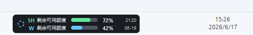
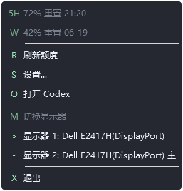
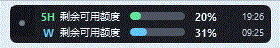
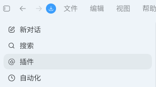
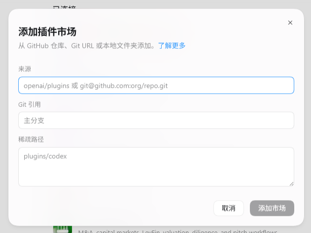
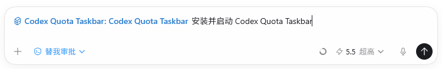

# Codex Quota Taskbar

Language: **English** | [简体中文](README.zh-CN.md)

Codex Quota Taskbar is a Windows taskbar quota overlay. It shows Codex 5-hour and weekly quota remaining inside the Windows taskbar, vertically centered, with an optional Codex Desktop activity indicator.





## Task Status Sync

The companion syncs the Codex Desktop conversation execution state. The status icon lives in the leftmost overlay slot and does not add text to the overlay.



- `Idle`: gray dot, meaning no conversation is progressing.
- `Running`: rotating blue dashed ring, meaning at least one conversation is actively running.
- `Complete`: green check, meaning a conversation just finished; it stays visible for 5 seconds before returning to idle.
- The preferred source is Codex Desktop IPC `thread-stream-state-changed` broadcasts.
- When state changes from `Running` to `Complete`, the companion immediately queues one quota refresh.

## Add It From Codex Desktop GUI

No command line is required. Use Codex Desktop to add the plugin marketplace, install the plugin, and start the companion.

1. Open Codex Desktop.
2. Click `Plugins` in the left sidebar.



3. On the Plugins page, click the dropdown next to the `+` button in the top-right corner.
4. Select `Add plugin marketplace`.


5. In the `Add plugin marketplace` dialog, fill in the fields exactly like this:

```text
Source: caomeiguojiang/codex-quota-taskbar
Git reference: main
Sparse path: leave empty
```

If the source field does not accept the short GitHub form, use:

```text
https://github.com/caomeiguojiang/codex-quota-taskbar.git
```

Do not put `plugins/codex-quota-taskbar` in `Sparse path`. This repository already has the marketplace file at the repository root; the marketplace points Codex Desktop to the plugin subfolder.

6. Click `Add marketplace`.



7. Return to the Plugins page and search for `Codex Quota Taskbar`.
8. Open the plugin card, then install and enable it.
9. Start a new Codex Desktop conversation.
10. Type: `Install and start Codex Quota Taskbar`.



11. After installation finishes, the quota overlay appears inside the Windows taskbar.

## Usage

- Left-click the overlay: refresh quota now.
- Right-click the overlay: open the context menu.
- Double-click the overlay: bring Codex Desktop to the front.
- Context menu `Settings...`: open settings.
- Context menu `Switch monitor`: move the overlay to another monitor.
- Context menu `Exit`: close the companion.

## Current Features

- Shows 5-hour and weekly quota remaining.
- Keeps the overlay vertically centered inside the target monitor taskbar.
- Supports multi-monitor selection with friendly monitor names.
- Supports Chinese and English UI.
- Uses the system language as the default language and falls back to English when unsupported.
- Supports an optional Codex activity icon.
- Shows running/loading while Codex is working.
- Shows complete for 5 seconds after a conversation finishes.
- Shows idle when no conversation is progressing.
- Refreshes quota in the background every 15 seconds.
- Refreshes quota immediately when Codex changes from running to complete.

## Settings And Runtime Data

Settings file:

```text
%APPDATA%\CodexQuotaTaskbar\settings.json
```

Logs directory:

```text
%LOCALAPPDATA%\CodexQuotaTaskbar\logs
```

Runtime state directory:

```text
%LOCALAPPDATA%\CodexQuotaTaskbar\runtime
```

## Implementation Notes

The current primary runtime is the native C# companion:

```text
plugins\codex-quota-taskbar\companion\bin\CodexQuotaTaskbar.exe
plugins\codex-quota-taskbar\companion\native\CodexQuotaTaskbar.cs
```

PowerShell remains in the package for install, start, stop, test wrappers, and legacy implementation reference. The overlay, tray monitor, settings dialog, Codex IPC activity listener, and quota polling are implemented by the native executable.

## Refresh Behavior

- Taskbar visibility and topmost pulse: every 2 seconds.
- Codex activity sampling: every 250 ms.
- Quota remaining background refresh: every 15 seconds.
- Codex changes from running to complete: queue an immediate refresh.
- Manual refresh: overlay left-click, context menu refresh, or tray menu refresh.

Quota refreshes run serially in the background. If a refresh is already running, one pending refresh is queued and runs after the current request finishes.

## Codex Activity Source

The activity icon prefers Codex Desktop IPC:

```text
\\.\pipe\codex-ipc
```

The companion listens for `thread-stream-state-changed` broadcasts and infers:

- `Running`: at least one known conversation is still progressing.
- `Complete`: the 5-second grace window after active work finishes.
- `Idle`: no conversation is progressing and the complete grace window has expired.

If IPC is unavailable, the companion falls back to local process activity heuristics.

## Limits

- This is a local Windows companion. It does not inject UI into Codex Desktop internals.
- It cannot appear over UAC secure desktop, lock screens, exclusive fullscreen apps, or stronger topmost windows.
- Quota reading depends on local Codex app-server behavior. If Codex changes that internal interface, the companion may need an update.
- Codex Desktop IPC is currently useful for activity state. Quota reading still uses the local app-server path.

## Maintenance Notes

The native code is still packaged as one large source file to match the current simple build and distribution path. The next valuable maintenance step is splitting `CodexQuotaTaskbar.cs` into focused source files.

Suggested split boundaries:

- options, paths, logging, and settings.
- quota service and Codex app-server protocol.
- Codex IPC activity source and activity state machine.
- monitor context and tray menu.
- overlay layout, WPF window, and context menu style.
- settings dialog and monitor display-name helpers.
- native self-tests and visual QA context.
